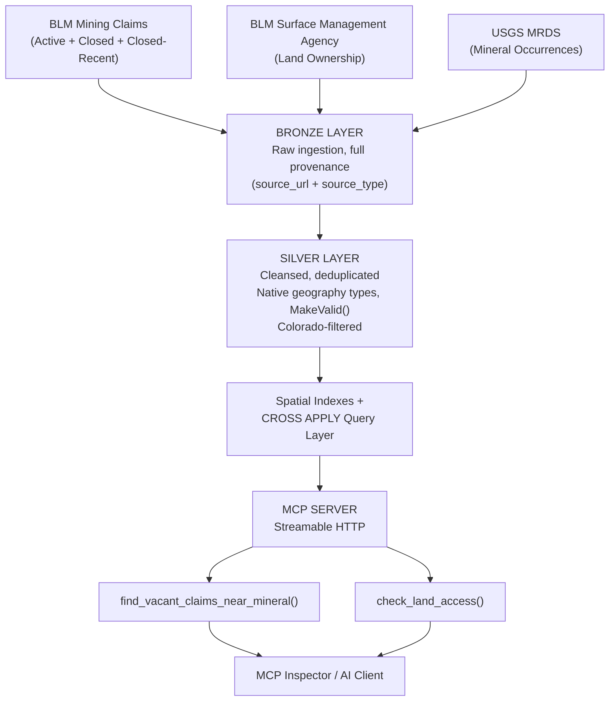

# RockHound — Colorado Rockhounding Intelligence Platform

A governed, spatially-aware data platform that answers a real question: "Where can I legally go rockhounding in Colorado, and what am I likely to find?" Built end-to-end from raw federal and state government data through a Medallion Architecture (Bronze/Silver-style layering) into a governed **MCP (Model Context Protocol) server** — allowing an AI agent to answer rockhounding questions grounded in real, curated, trustworthy spatial data rather than raw or unverified sources.

**Repo structure:** SQL scripts in [`/sql`](./sql), Python code in [`/python`](./python) — see those folders for the actual implementation.

---

## The Goal

Combine multiple independent public datasets — mining claim status, land ownership, and historical mineral occurrence records — into a single queryable platform, then expose that data to an AI system through a governed interface that only surfaces specific, safe, pre-approved queries rather than raw database access. This mirrors the same "AI-ready, governed data product" pattern increasingly asked for in modern data engineering roles.

**Specific question this answers:** "Find vacant/lapsed mining claims near documented occurrences of a mineral, and tell me whether I'm actually allowed to be there."

---

## Architecture



---

## Real Data Sources (all public, all free)

| Source | What it provides | Records (Colorado, filtered) |
|---|---|---|
| [BLM National GIS Hub](https://gbp-blm-egis.hub.arcgis.com/) — MLRS Mining Claims, Not Closed | Active mining claims | 14,699 |
| [BLM National GIS Hub](https://gbp-blm-egis.hub.arcgis.com/) — MLRS Mining Claims, Closed (full history) | Historical/vacant claims | 288,158 |
| [BLM National GIS Hub](https://gbp-blm-egis.hub.arcgis.com/) — MLRS Mining Claims, Closed (last year) | Recency flag source | 1,165 |
| [BLM Colorado GIS Data Portal](https://www.blm.gov/site-page/services-geospatial-gis-data-colorado) — Surface Management Agency | Land ownership (BLM, USFS, private, tribal, etc.) | 21,175 |
| [USGS Mineral Resources Data System (MRDS)](https://mrdata.usgs.gov/mrds/) | Historical documented mineral occurrences | 17,669 |
| [US Census TIGER/Line — Counties](https://catalog.data.gov/dataset/tiger-line-shapefile-current-nation-u-s-county-and-equivalent-entities) | County boundaries (national file, Colorado-filtered) | 64 |
| [US Census TIGER/Line — Places](https://catalog.data.gov/dataset/tiger-line-shapefile-current-state-colorado-place) | City/town/CDP boundaries, Colorado-specific | varies |
| [Colorado Geological Survey — Geothermal Map v3](https://coloradogeologicalsurvey.org/geology/gis-data-map-portal/) (Hot Springs) | Hot spring locations, temperature, use type, geothermometer estimates | 93 (matches official published count) |
| [USGS National Hydrography Dataset (NHD)](https://apps.nationalmap.gov/downloader/) — NHDFlowline | Named rivers/streams, filtered to StreamRiver + ArtificialPath feature types | 125,495 segments (aggregates to real river-scale totals — see challenges below) |
| [Macrostrat](https://macrostrat.org) — Geologic Units API | Bedrock/geologic formation data, lithology, geologic age | Queried live per-coordinate, not bulk-loaded (see "Tech Stack" note) |
| [OpenStreetMap](https://www.openstreetmap.org) (via the [Overpass API](https://overpass-api.de/), tag [highway=trailhead](https://wiki.openstreetmap.org/wiki/Tag:highway%3Dtrailhead)) | Trailhead locations, operator, fee info | 552 (name populated on 85%, operator on 16%, fee on 8%) |
| [Open-Elevation](https://open-elevation.com) (API) | Ground elevation at a coordinate, in meters | Queried live per-coordinate, not bulk-loaded |
| [OpenStreetMap](https://www.openstreetmap.org) (via the [Overpass API](https://overpass-api.de/), tag [highway=track](https://wiki.openstreetmap.org/wiki/Tag:highway%3Dtrack)) | Track/dirt road locations, surface, tracktype, 4wd_only, smoothness — for vehicle-access matching | 73,703 (surface populated on 29%, tracktype on 16%, 4wd_only on 5%, smoothness on 10%) |

All source records carry `source_url` and `source_type` (e.g., "Government Agency") for full data lineage and provenance tracking — a governance pattern built in intentionally, not an afterthought.

---

## Tech Stack

- **SQL Server** — native `geography` spatial data type, spatial indexing, `STDistance`/`STIntersects`/`STContains`, `MakeValid()`
- **Python** — `geopandas`, `pandas`, `pyodbc`, `shapely`
- **MCP Python SDK** (`mcp.server`) — Streamable HTTP transport
- **MCP Inspector** — official tooling for testing/verifying MCP servers
- **Cloudflare Tunnel** — local HTTPS exposure for remote MCP client testing

---

## Tools & Platforms Used

A detailed breakdown of what was used for what, since the actual development environment is part of the real story here.

### Data Sources (where the raw data came from)
| Source | Access Method | Use Case |
|---|---|---|
| [BLM Colorado GIS Data Portal](https://www.blm.gov/site-page/services-geospatial-gis-data-colorado) | Direct download (Shapefile/GeoJSON) | Colorado-specific Surface Management Agency (land ownership) data |
| [BLM National GIS Hub](https://gbp-blm-egis.hub.arcgis.com/) (ArcGIS Hub) | Direct download (GeoJSON / File Geodatabase) | Mining claims (Active, Closed, Closed-Last-Year) — note: these particular downloads turned out to be *national* scope despite being found via a Colorado-focused search, which is why the Colorado bounding-box filter exists in `load_bronze.py` |
| [USGS MRDS](https://mrdata.usgs.gov/mrds/) | Direct download (CSV, "Flattened" format) | Historical mineral occurrence records — also nationwide by default, filtered to Colorado via the `state` column |
| [US Census TIGER/Line Shapefiles](https://catalog.data.gov/dataset/tiger-line-shapefile-current-nation-u-s-county-and-equivalent-entities) | Direct download (Shapefile) | County boundaries (national file, filtered to Colorado via `STATEFP`) and Colorado-specific Places (cities/towns/CDPs) |
| [Colorado Geological Survey GIS Data Portal](https://coloradogeologicalsurvey.org/geology/gis-data-map-portal/) | Live ArcGIS REST Feature Service query (found by browsing the agency's REST services directory, not exposed in the public web map's UI) | Hot spring locations, temperature, use type, geothermometer estimates |
| [USGS National Map Downloader](https://apps.nationalmap.gov/downloader/) | Direct download (Shapefile, NHDFlowline feature class) | Named rivers/streams for placer-deposit proximity search |
| [Macrostrat](https://macrostrat.org) | Live REST API query per-coordinate | Bedrock/geologic formation data, lithology, geologic age |
| [Overpass Turbo](https://overpass-turbo.eu/) (OpenStreetMap query tool) | One-time bulk GeoJSON export via Overpass QL query, tag `highway=trailhead` | Trailhead locations across Colorado |
| [Open-Elevation](https://open-elevation.com) | Live REST API query per-coordinate | Ground elevation lookup |
| [Overpass Turbo](https://overpass-turbo.eu/) (OpenStreetMap query tool) | One-time bulk GeoJSON export via Overpass QL query, tag `highway=track` | Track/dirt road segments for vehicle-access matching (73,703 records — see "Real Engineering Challenges Solved" for the scale/coverage checks done before committing to this bulk-load approach) |

### Database & Query Development
| Tool | Use Case |
|---|---|
| **SQL Server Express** (local instance, named `SQLEXPRESS`) | The actual database engine — chosen because it's free and already commonly available for a personal project |
| **SQL Server Management Studio (SSMS)** | Schema creation, data verification, query development and testing, and — critically — **execution plan analysis** (Ctrl+M) used to diagnose the spatial index performance issue |

### Python Development
| Tool | Use Case |
|---|---|
| **Python 3.14** | Data ingestion scripting (`load_bronze.py`) and the MCP server itself (`rockhound_server.py`) |
| **pip** | Package management — `geopandas`, `pandas`, `pyodbc`, `shapely`, `mcp` |
| **PowerShell** | Running all Python scripts, file/folder management, and — notably — used directly to *write* source files via here-strings (`@'...'@ \| Set-Content`) when a text-editor save issue caused repeated stale-file problems mid-build |
| **winget** (Windows Package Manager) | Installing Python, the ODBC Driver 18 for SQL Server, and `cloudflared` |

### MCP-Specific Tooling
| Tool | Use Case |
|---|---|
| **MCP Python SDK** (`mcp` package, `mcp.server`) | Building the actual governed MCP server and its two tools |
| **MCP Inspector** (`npx @modelcontextprotocol/inspector`) | The official tool used to test and verify the server's tools work correctly — this became the primary demo/verification method after a specific consumer AI client's remote-connector flow turned out to require OAuth client registration that was out of scope for this project |
| **Cloudflare Tunnel** (`cloudflared`) | Exposed the local Streamable HTTP server over a temporary public HTTPS URL, since some MCP client integrations require HTTPS even for local development/testing |

### Version Control & Hosting
| Tool | Use Case |
|---|---|
| **GitHub** | Hosting this repository as part of a broader data engineering portfolio |


Five governed tools, deliberately scoped rather than exposing raw SQL access to an AI system:

**`find_vacant_claims_near_mineral(mineral_name, max_distance_miles, max_results)`**
Finds vacant/lapsed claims near documented historical occurrences of a given mineral, flagging which claims closed most recently (freshest opportunities), which county each falls in, and sorting by proximity. Results are capped (default 50) with a note when more exist, for both usability and performance reasons -- see the performance investigation in "Real Engineering Challenges Solved."

**`check_land_access(latitude, longitude, mineral_search_radius_miles)`**
Given a coordinate, returns a complete site report: land ownership type, every active mining claim covering that point (since any one active claim means "do not dig," and multiple claims commonly overlap in dense historic districts), a summarized vacant-claim count, the county, the nearest city and its distance, the nearest named river and its distance (useful for placer-deposit potential), the nearest trailhead and its distance, documented minerals within a configurable radius (deduplicated at the individual-mineral level, not the raw-record level), and any hot springs within that same radius -- since hot springs and mineral-rich water are geologically related.

**`check_vehicle_access(latitude, longitude, vehicle_name)`**
Given a coordinate and a vehicle profile (from a small `Dim_Vehicle` reference table, currently populated with a real 2020 Ford Escape: 7.9" clearance, AWD, no low-range), finds the nearest mapped track/road and evaluates its OpenStreetMap surface/difficulty tags against that vehicle's real capabilities. Honestly reports "no difficulty data available" when a segment isn't tagged (the majority case), rather than assuming a road is safe by default -- verified against both a real untagged segment and a real known-hazardous one (`4wd_only=yes`, `smoothness=very_bad`) to confirm both branches of the logic actually work, not just the fallback.

**`get_bedrock_geology(latitude, longitude)`**
Given a coordinate, queries the live Macrostrat API for bedrock/geologic formation data at that point -- rock unit name, lithology, and geologic age. Deduplicates by (unit name, lithology) since multiple overlapping source maps at different scales commonly cover the same coordinate.

**`get_elevation(latitude, longitude)`**
Given a coordinate, queries the live Open-Elevation API for ground elevation, returned in both meters and feet.

The first three tools (`find_vacant_claims_near_mineral`, `check_land_access`, `check_vehicle_access`) query only the curated Silver layer through fixed, parameterized queries -- the AI never gets arbitrary database access, only these specific, safe, purpose-built answers. The last two (`get_bedrock_geology`, `get_elevation`) are the deliberate exception: both query live external APIs rather than local data, and are kept as separate, clearly-labeled tools so an external API's latency or availability can never affect the core governed local-data tools.

---

## Real Engineering Challenges Solved

This section exists because the debugging process is arguably the most representative part of the whole project — real data engineering isn't a clean first pass. See [`/sql/04_example_queries.sql`](./sql/04_example_queries.sql) for the actual diagnostic queries used to find and fix these.

1. **Invalid spatial geometry.** Real-world government GIS polygon data included self-intersecting/invalid geometries that caused runtime failures in SQL Server's strict `geography` type (`24144: instance is not valid`). Fixed with `.MakeValid()` applied during the Bronze-to-Silver transformation — see [`/sql/02_silver_schema_and_transform.sql`](./sql/02_silver_schema_and_transform.sql).

2. **A silent data-mapping bug.** The mineral search was initially matching against `mineral_name` (a mine's site name, e.g. "Silver King Mine") rather than `commodity_type` (what was actually documented as found there) — a correctness bug caught by comparing row counts: 11 site-name matches for "Quartz" vs. 82 real commodity matches.

3. **A real performance/query-plan problem.** A straightforward `JOIN ... ON STDistance(...) < X` pattern caused queries to silently take 13+ minutes for common minerals, because SQL Server's optimizer wasn't using the spatial index for that join shape — confirmed via execution plan analysis showing 124M+ estimated row operations on a nested loop join. Fixed by restructuring the query around `CROSS APPLY` (the documented pattern for reliably triggering spatial index usage in nearest-neighbor searches), bringing the same query down to ~36 seconds. See [`/sql/04_example_queries.sql`](./sql/04_example_queries.sql).

4. **National-scope data filtering.** Several "Colorado" datasets from federal sources were actually nationwide (one active-claims file was 579,730 rows before filtering to Colorado's 14,699). Filtered via bounding-box intersection during ingestion rather than loading and discarding downstream — see `COLORADO_BBOX_WKT` in [`/python/load_bronze.py`](./python/load_bronze.py).

5. **MCP client integration.** Discovered that the target MCP client's remote-connector flow expected OAuth client registration even for unauthenticated local servers. Worked around by running the server over Streamable HTTP with a Cloudflare quick tunnel for HTTPS, and validated functionality through the official MCP Inspector tool rather than a single consumer app's specific auth requirements.

6. **Inverted polygon ring orientation, affecting three separate tables.** Shapefile- and File-Geodatabase-sourced polygons (Counties, Cities, and the large historical Claims dataset) were sometimes stored with reversed ring winding order -- SQL Server's `geography` type interpreted these as "everywhere except X" rather than "X," which `.MakeValid()` does not detect or fix (it only repairs self-intersections, not orientation). Diagnosed by checking `STArea()` for implausibly large values (a genuine, correctly-oriented Colorado county should never approach ~510,000,000 sq km -- Earth's total surface area). Fixed with a conditional `.ReorientObject()` based on an area threshold. A first attempt at this fix used the wrong unit (`STArea()` returns square *meters*, not square kilometers), which incorrectly flipped several genuinely large, correctly-oriented counties -- caught and corrected by re-validating against all 64 real Colorado counties.

7. **A recurring parameter-count bug class, and a structural fix.** Repeating `geography::Point(?, ?, 4326)` inline multiple times within a single query made it easy to miscount the required parameter list, causing two separate "wrong parameter count" runtime errors. Fixed structurally by computing the coordinate point once via a SQL `DECLARE @searchPoint GEOGRAPHY = ...` variable and referencing it throughout the query, reducing most queries to just 2 real parameters and eliminating the bug class going forward rather than just fixing the immediate instance.

8. **A data-completeness design gap, not a bug.** `check_land_access` originally returned a single arbitrary claim via `TOP 1` with no explicit ordering. Testing against a real, known claim ("Rocket Six," verified against a friend's actual mining claim data) revealed that 14 separate claims -- 6 active, 8 vacant -- legitimately overlap that one coordinate, which is normal for a dense historic Colorado mining district. The fix wasn't a bug patch but a deliberate design decision: list every active claim by name (since any one of them means "do not dig"), and summarize vacant claims as a count rather than silently picking one and hiding the rest.

9. **A multi-stage performance investigation on a per-row enrichment lookup.** After adding a county lookup to enrich mineral-search results, common minerals (Quartz: ~24,570 raw matches) began timing out via the MCP tool call. Debugging ruled out several plausible causes in turn: capping with `TOP (N)` at the SQL level actually made things *dramatically worse* (4+ minutes vs. ~6 seconds uncapped) due to a SQL Server optimizer regression when `TOP` is combined with `ORDER BY` on an expensive computed column; capping in Python after fetching didn't help either, since the real cost was still being paid inside SQL Server before results were returned; and rewriting the county lookup as a correlated subquery, a `JOIN`, and an `OUTER APPLY` were all equally slow (~4 minutes), proving the bottleneck was the sheer number of spatial lookups (one per raw match), not query syntax. The actual fix: a two-phase query -- fast distance-only matching and capping first, then a spatial county lookup only on the small final result set (<=50 rows) instead of on every raw match. This is a good example of systematic elimination of plausible-but-wrong hypotheses being the real work of performance debugging, not a single clever fix found immediately.

10. **Finding an undocumented data source (Phase 2).** A public-facing Colorado Geological Survey hot springs web map (an Esri Web AppBuilder app) didn't expose its underlying data source anywhere in its UI. Rather than falling back to manually transcribing a narrative PDF report, the real REST Feature Service was tracked down by browsing the agency's public ArcGIS REST services directory (`cgsarcimage.mines.edu/arcgis/rest/services`) folder by folder, then confirming the correct layer by inspecting its field list before writing any load code. This turned a planned manual-entry data source into a fully automated one, and surfaced richer data (real geothermometer chemistry estimates, flow rate, use type) than the PDF alone would have.

11. **A field-level deduplication bug.** A "documented minerals nearby" feature deduplicated on entire comma-separated commodity strings (e.g. `"Beryllium, Tantalum"` vs. `"Tantalum, Beryllium, REE"`), so the same individual mineral could still appear multiple times in the output if it showed up across different multi-mineral site records -- correct SQL-level `DISTINCT`, wrong level of granularity. Fixed by splitting each record's commodity list into individual mineral names and deduplicating at that level instead, verified by confirming a real test location's mineral list dropped from 28 entries with visible repeats to 15 genuinely distinct minerals.

12. **A silent WKT format incompatibility.** Line geometries exported by geopandas from this source (which includes an elevation/M-value dimension) were written as `LINESTRING Z (...)`, a WKT tag format SQL Server's `geography` parser does not recognize (`24142: Expected "(" at position 11. The input has "Z"`). Fixed by stripping the `Z` tag from the WKT string before parsing -- the underlying coordinate data is unaffected, only the malformed tag needed removal.

13. **A wrong data-completeness assumption caught by aggregation, not a single test case.** Filtering NHDFlowline to `FType 460` (StreamRiver) seemed like the obvious way to isolate real rivers/streams from canals, ditches, and pipelines. Loading succeeded without error and returned a plausible-looking row count -- but grouping the loaded data by river name and summing length revealed every major Colorado river (Colorado River, South Platte, Arkansas River) had implausibly short total lengths (e.g. Colorado River: ~51 km, when its real length through the state is roughly 450-500 km), while minor named creeks correctly showed hundreds of kilometers. Root cause: NHD represents the wider stretches of major rivers (anywhere they're mapped as a polygon area rather than a simple line) using a separate `FType 558` (ArtificialPath) code for network connectivity, which the original filter excluded entirely. Including both FTypes brought every major river to a realistic total length. This is a good example of why a single successful test case (a small creek, correctly represented as FType 460 for its entire length) doesn't validate a filter for the whole dataset -- aggregate validation caught what a spot-check would have missed.

14. **A silently wrong test result from a caching/URL-matching quirk.** Before writing any bedrock-geology code, an initial test fetch of Macrostrat's lat/lng query endpoint appeared to succeed, but actually returned content from a different, earlier-cached query (a `strat_name_id`-based request from unrelated documentation) rather than genuinely querying the intended coordinate -- the response looked plausible (real GeoJSON, real geologic unit names) but was quietly wrong. Caught by noticing the returned units were scattered across Texas, Wyoming, and Alabama rather than clustered at the one Colorado coordinate requested. Re-tested by having the actual query URL fetched directly and independently, which returned correct, tightly-clustered results. A good reminder that a response "looking successful" (valid JSON, real-looking data) is not the same as confirming it actually answers the specific question asked.

15. **A deliberate architectural boundary between governed local data and live external data.** Bedrock geology data doesn't fit the Bronze/Silver bulk-load pattern used everywhere else in this project -- Macrostrat is naturally point-queried rather than bulk-downloadable in a useful way. Rather than forcing it into the existing pattern or, alternatively, folding it into `check_land_access` for convenience, it was built as a separate, isolated tool (`get_bedrock_geology`) that queries the live API directly. This keeps the core governed tools (backed entirely by curated local data) free of external-API latency and availability risk, while still surfacing genuinely useful bedrock context through a clearly separate, clearly-labeled tool.

16. **Realistic field-coverage assessment before overselling a data source (Phase 3).** OpenStreetMap's `highway=trailhead` tag set includes fields (`ele`, `4wd_only`, `access`, `motor_vehicle`) that looked like they might partially satisfy two other planned Phase 3 goals (elevation and vehicle-access matching) for free. Checking actual coverage across all 552 real Colorado trailheads showed these fields populated on fewer than 5% of records -- not a real dataset, just scattered examples. Only `name` (85%), `operator` (16%), and `fee` (8%) had meaningful, usable coverage. Caught before building anything on the assumption that "the field exists" meant "the field is usable" -- Phase 3's elevation and vehicle-access work still needed their own dedicated sources.

17. **A silent Phase 1 data-quality bug surfaced two phases later.** A `check_land_access` result unexpectedly included `"nan"` in its documented-minerals list, alongside real mineral names like Gold and Silver -- plausible enough at a glance to almost pass as legitimate. Root cause: the original Phase 1 loader (`load_bronze.py`) used pandas, which represents missing numeric-like values as `NaN`; when cast to a Python string during insertion, this became the literal text `"nan"` rather than a true NULL, and was stored as if it were a real commodity value. Affected 1,564 rows, undetected through all of Phase 1 and most of Phase 2. Confirmed via `COUNT(*)` (1,564 exact matches) and ruled out messier mixed-string cases (a `LIKE '%nan%'` check after the fix returned zero rows) before concluding a single `UPDATE` had resolved it completely. Fixed at the Silver data layer (converted to true `NULL`) rather than patched at the application/tool level, so every future query against the table is covered automatically.

18. **The same caching/URL-matching quirk from challenge #14, recurring with a different API.** Before writing the elevation tool, an initial test fetch of the Open-Elevation API appeared to succeed -- valid JSON, a real-looking elevation value -- but the returned coordinates (41.16, -8.58, in Portugal) were the literal example coordinate from that API's own documentation page, not the Colorado coordinate actually requested. Caught immediately this time, faster than the first occurrence, specifically *because* it had already been documented as a known failure mode earlier in the project. Re-verified by having the real URL tested directly and independently, which returned a correct, plausible Colorado elevation (2,704 m at a known test coordinate). A good demonstration of why documenting a lesson (not just fixing the immediate instance) pays off the next time the same failure mode shows up somewhere new.

19. **Two rounds of the same column-width bug, one layer apart.** Loading real OpenStreetMap track/road tag data (`highway=track`, 73,703 segments) hit a `String data, right truncation` error on `tracktype` at the Bronze layer -- an initial `VARCHAR(20)` was too narrow for real crowdsourced tag values (which aren't always the clean `grade1`-`grade5` format assumed). Widened the affected Bronze columns and reloaded successfully -- but the identical error then recurred one layer downstream, in Silver, which still had the original narrower column definitions inherited from the initial schema design. A reminder that a fix applied to one layer of a Bronze/Silver pipeline doesn't automatically propagate to the next; both layers needed the same correction applied separately.

20. **A deliberate "honest uncertainty" design principle, verified against both of its own branches.** OpenStreetMap's difficulty-related tags (`surface`, `tracktype`, `4wd_only`, `smoothness`) are populated on only 5-29% of the 73,703 loaded track segments -- meaning most coordinate lookups will find a segment with no explicit difficulty rating at all. Rather than defaulting to "likely passable" for untagged segments (which would be a false, unearned assurance) or "unknown, proceed with extreme caution" for everything (which would make the tool useless whenever real hazard data *does* exist), `check_vehicle_access` explicitly distinguishes and reports three different states: a real, specific hazard flag; an honest "no data available"; and a genuine "no red flags in available tags." Verified all the way through by testing against two real coordinates that happened to hit untagged segments (confirming the honest fallback), then deliberately pulling a real coordinate directly from a known-tagged road (`Forrester Road`: `surface=unpaved`, `4wd_only=yes`, `smoothness=very_bad`) to confirm the actual hazard-flagging branch fires correctly too -- not just the easier-to-hit fallback case.

---

## Example Output

```
> find_vacant_claims_near_mineral(mineral_name="Quartz", max_distance_miles=20)

Showing closest 50 of 24570 total matches:
AVENGER #15, Park County - 0.7 mi from documented Quartz
GAMBLE NO 1, Park County - 2.9 mi from documented Quartz
SARAH K #45, Chaffee County - 4.6 mi from documented Quartz
...

> check_land_access(latitude=38.7431, longitude=-106.1742, mineral_search_radius_miles=5.0)

Land type: PRI
County: Chaffee
Nearest city: Buena Vista (4.7 mi away)
Nearest named river: Merriam Creek (0.4 mi away)
Nearest trailhead: Wagon Loop Trail (5.1 mi away)
Documented minerals within 5.0 mi: Construction, Copper, Geothermal, Gold, Granite, Sand and Gravel, Silver
Hot springs within 5.0 mi: Mt. Princeton Hot Springs (84.00°C, 0.7 mi)

> get_bedrock_geology(latitude=39.5, longitude=-105.7)

Bedrock geology at this location (3 mapped unit(s), from overlapping source maps at different scales):
  - Paleoproterozoic metamorphic and undivided crystalline: sedimentary and volcanic gneiss (Paleoproterozoic) -- lithology: metamorphic and undivided crystalline: sedimentary and volcanic gneiss
  - Biotitic gneiss, schist, and migmatite (Paleoproterozoic) -- lithology: Major:{biotite gneiss,schist,migmatite}, Minor:{gneiss,calc silicate schist,marble}
  - Paleoproterozoic crystalline metamorphic rocks (Paleoproterozoic) -- lithology: orthogneiss/paragneiss

> get_elevation(latitude=38.7431, longitude=-106.1742)

Elevation at this location: 2704 m (8871 ft)

> check_vehicle_access(latitude=40.942218, longitude=-106.001034)

Nearest mapped track: Forrester Road (0.0 mi away)
Vehicle: 2020 Ford Escape (7.9" clearance, AWD, no low-range)
LIKELY NOT SUITABLE for this vehicle: tagged 4wd_only='yes'; smoothness='very_bad'. This vehicle has no low-range transfer case.
```

Note the cross-source validation: "Geothermal" appears independently in the USGS mineral database at the same location where the Colorado Geological Survey's hot springs data shows Mt. Princeton Hot Springs (84°C), and the nearest named river (Merriam Creek, a real tributary in that same drainage) confirms the tool correctly favors precise nearby features over the much larger but farther-away Arkansas River -- three independently sourced datasets all coherently describing the same real place. The vehicle-access example above was deliberately tested against a coordinate pulled directly from a known-tagged road (rather than an arbitrary point) specifically to confirm the hazard-flagging logic works, not just its "no data available" fallback.

---

## Repo Contents

```
RockHound/
├── README.md
├── sql/
│   ├── 01_bronze_schema.sql          -- Bronze table DDL
│   ├── 02_silver_schema_and_transform.sql  -- Silver DDL + MakeValid() + dedup logic
│   ├── 03_spatial_indexes.sql        -- Spatial index creation
│   ├── 04_example_queries.sql        -- Diagnostic + optimized query patterns
│   ├── 05_cities_counties_schema_and_load.sql  -- County/city boundary layer
│   ├── 06_hot_springs_schema_and_load.sql      -- Hot springs layer (Phase 2)
│   ├── 07_rivers_schema_and_load.sql           -- Rivers layer (Phase 2)
│   ├── 08_trailheads_schema_and_load.sql       -- Trailheads layer (Phase 3)
│   └── 09_tracks_vehicle_access_schema_and_load.sql  -- Tracks + Dim_Vehicle (Phase 3)
└── python/
    ├── load_bronze.py                -- Bronze ingestion (Colorado-filtered, fast bulk insert)
    ├── load_hot_springs.py           -- Hot springs loader (live REST API query, Phase 2)
    ├── load_rivers.py                -- Rivers loader (NHD, Phase 2)
    ├── load_trailheads.py            -- Trailheads loader (OpenStreetMap/Overpass, Phase 3)
    ├── load_tracks.py                -- Tracks loader (OpenStreetMap/Overpass, Phase 3)
    └── rockhound_server.py           -- MCP server with all 5 governed tools, including
                                          get_bedrock_geology and get_elevation (no separate
                                          load script or SQL file for either -- both are
                                          queried live from their respective APIs on each
                                          tool call, not bulk-loaded, so there's no
                                          Bronze/Silver step for either source)
```

---

## Roadmap

- **✅ Phase 1 (complete):** Core platform — mining claims, land ownership, mineral occurrences, counties, and cities. Full Bronze/Silver Medallion Architecture, spatial indexing, and the two foundational governed MCP tools (`find_vacant_claims_near_mineral`, `check_land_access`). See "Real Engineering Challenges Solved" #1-9 for the real bugs found and fixed here.
- **✅ Phase 2 (complete):**
  - ✅ Hot springs (Colorado Geological Survey, live REST API) — done, integrated into `check_land_access`
  - ✅ Rivers/streams (USGS NHD, placer deposit potential) — done, integrated into `check_land_access`
  - ✅ Bedrock/geologic formation data (Macrostrat live API) — done, as a separate `get_bedrock_geology` tool
- **✅ Phase 3 (complete):**
  - ✅ Trailheads (OpenStreetMap via Overpass API) — done, integrated into `check_land_access`
  - ✅ Elevation data (Open-Elevation API) — done, as a separate `get_elevation` tool
  - ✅ Vehicle-specific road access matching (OpenStreetMap track/road tags vs. a real vehicle profile in `Dim_Vehicle`) — done, as a separate `check_vehicle_access` tool

All three original planning phases are now complete. Five governed MCP tools, real data end to end, verified against real ground-truth coordinates throughout.

---

## Data Attribution

Data provided by the Bureau of Land Management (BLM) and U.S. Geological Survey (USGS), used in accordance with their public data terms. This is a personal project and is not affiliated with or endorsed by BLM or USGS. Data is provided "as is" and may contain errors or omissions — always verify claim status and land access independently before visiting any site in person.

---

## Other Projects

- **[Data Engineering & Systems Architecture Portfolio](https://github.com/crjiminez03/Data-Engineering-Systems-Architecture-Portfolio)** — A production-grade Medallion Architecture platform built on Microsoft Fabric, including PySpark/Delta Lake pipelines, Copilot Studio AI agents, KQL Eventhouse analytics, and full CI/CD via Azure DevOps.
